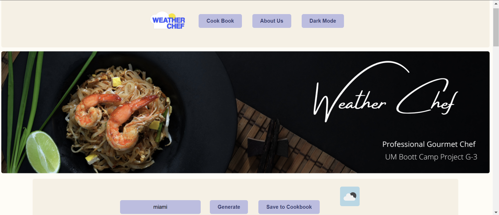

# Group-3-Project
As a user I want to receive recomendations tailored to the current weather conditions in my area, so I can prepare meals that complement the climate and season.

I want to log in and input my location for accurate weather data. Upon accessing the app, I expect clear weather information. Based on the weather, I'd like recipe suggestions based on the weather conditions and categorized according to types such as dinner, desserts, and snacks. Each recipe includes a brief description, ingredient list, step-by-step instructions, and appropriate categorization. Users can save, share, and provide feedback on recipes to enhance the recommendation algorithm.  

By implementing these features, user will be able to discover new and exciting recipes that only satisfy their culinary cravings but also align with the weather conditions in their area, enhancing their overall cooking experience.

To use, simply open index.html file and type in a city. The app will give you a recipe and food based on the current weather of that city. 